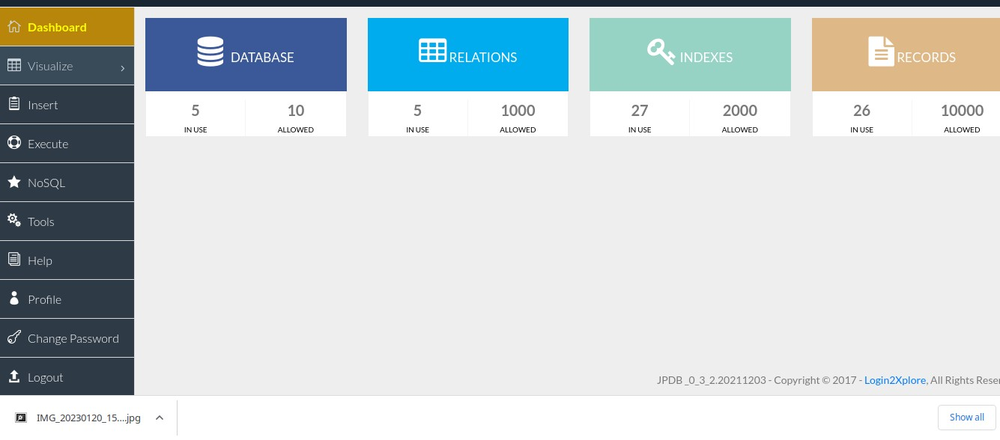
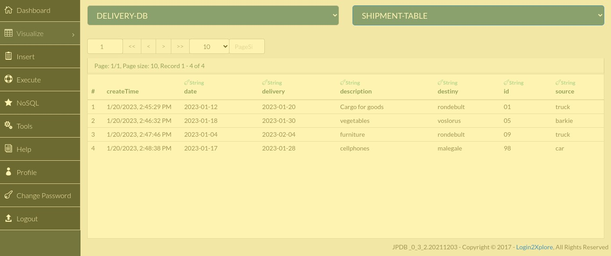
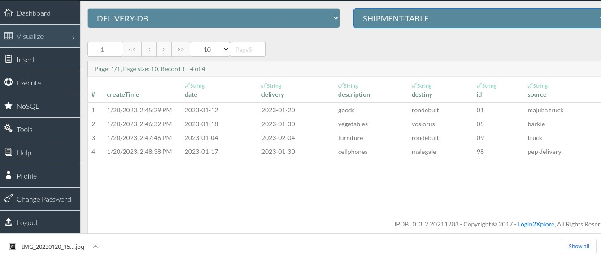

# Shipment-management form project
## This project uses JPDB to store data in the database.

**_JSONPowerDB is a High Performance, Light Weight, Ajax Enabled, Serverless, Simple to Use, Real-time Database. Easy and fast to develop database applications without using any server side programming / scripting or without installing any kind of database.
JPDB has ready to use API for Json document DB, RDBMS, Key-value DB, GeoSpatial DB and Time Series DB functionality. JPDB supports and advocates for true serverless and pluggable API development._**

[&#9889;Documentation Link](https://login2explore.com/jpdb/docs.html#jpdb-command-request)

**_Benefits of using JsonPowerDB_**
  - It is realtime and simple to use.
  - Easy to maintain the reconds.
  - Serverless support - fast development - cuts time to market.
  - Build using world's fastest indexing engine PowerIndex which gives unlimited data capacity, supporting unlimited indexes, realtime data processing which makes it fast and secure.
  - Give developer friendly Webservices API which reduce the developement cost.
  - Multiple Security Layers.
  - Schema free - easy to maintain
  - A single instance - Million Indexes
  - Inbuilt support for querying multiple databases.
  - It is light weight.
  - It is a serverless database so that you don't have to choose an instance size at all.
  
**_Use cases:_**
  - All RDMS use cases.
  - All key-value use cases.
  - All document use cases.
  -Time series/geospatial analytics.
  - Real time application for data analytics.
  - Live working HTML templates.
  - Any software application that needs backend DB. (Dynamic web-apps/Mobile/Desktop Apps)
  
  
  
  
  The Dashboard of JASONPOWERDB looks like in the above screenshoot. this is where the user create connection token and enjoy with other benefits .
  
  

JSPD is easy to use, the user  input data to Shipment-management form and the data is stored in the Jpdb see the screenshoot below:

The user can aswell update the database, below is the updated screenshoot.

👤 **AUTHOR**

- Email: [nellencr@gmail.com](mailto:nellencr@gmail.com)
- Github: [@nellencr](https://github.com/nellencr)
- Twitter: [Nella](https://twitter.com/Nella75794271)
- Linkedin: [Nela Komane](https://www.linkedin.com/in/nela-komane-8866b9192/)

  
 
